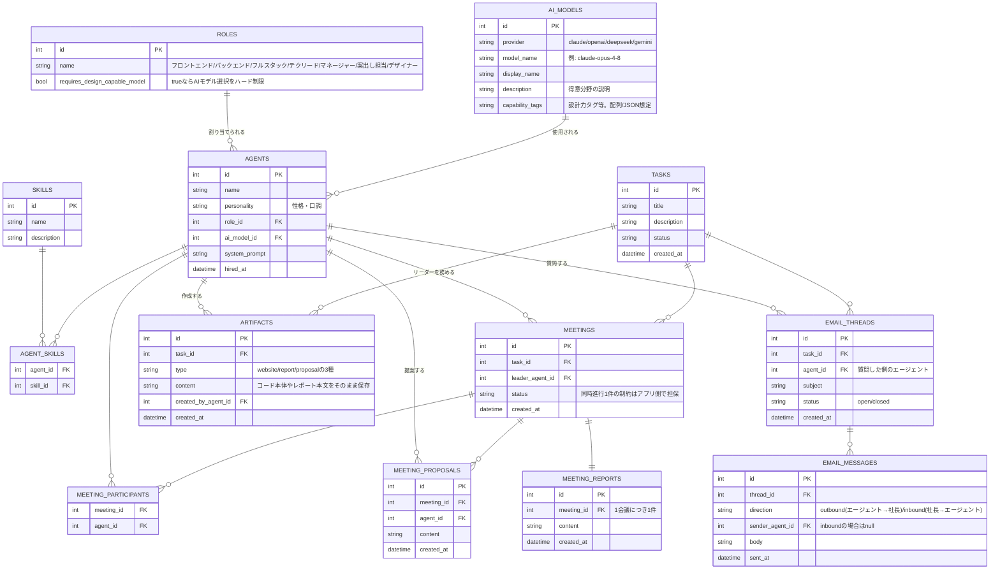

# DATABASE.md

本ファイルは `agents-company` のDBスキーマ設計のリファレンスです。エージェントが複数体に増えることを見据えて設計しました。

**ステータス**: ER図・テーブル構成は2026-07-25時点でレビュー済み（確定）。**2026-07-27に、SQLAlchemyモデル・Alembicマイグレーション・初期データ投入（seed）・`agents_registry.py`のDB化まで実装済み**（下記「今後の実装ステップ」の1〜4）。セットアップ手順・動かし方は`memo/DB利用方法.md`を参照。残りのステップ（会議室API・成果物API・メールAPI）は未着手（進捗管理は`AGENTS.md`の「今後の実装予定（ロードマップ）」を参照）。

**実装にともなう変更点**: `agents.id`はint PKのため、`POST /api/tasks`・`GET /api/agents`で使う`agent_id`はDB化前の文字列（例: `"idea_agent"`）から**数値**に変わっている。

## 前提となる主な機能

DB設計は、以下の機能を実現することを前提にしています。

- **エージェントを雇う機能**: 各エージェントは性格・名前・キャラクター・役割（役職）・スキルを持つ。
- **複数エージェントでの対話機能**: お題の内容によって進行フローが変わる（誰が呼ばれるか・何ステップ踏むか等）。これは主にLangGraph側（条件付きEdge）の設計課題であり、DB側は「どのフローを通って進んだか」の結果を記録できれば十分という整理。
- **エージェントの立場（役職）指定**: フロントエンド／バックエンド／フルスタック／テクリード／マネージャー／案出し担当／デザイナー。社長が自由に指定できるが、**テクリード等「上流工程」寄りの役職では、選べるAIモデルをハード制限する**（設計・判断に強いモデルしか選択肢に出さない）。
- **エージェント作成時のAIモデル指定**: 例）claude-opus、claude-haiku等。各モデルの得意分野は**事前にDBへ登録**しておき、選択時に表示する。
- **お題だし機能（社長）**。
- **会議室での話し合い機能**: 社長が「リーダー」と「参加者」を指定 → 各参加者が提案を出す → リーダーが全提案を集約して会議レポートを作成する。**会議室は1つのみ**（拠点構成の通り）。同時に進行できる会議は常に1件という制約は、DBではなく**アプリケーション側のロジックで担保**する（DB制約は設けない）。
- **エージェントの作業内容をリアルタイムで閲覧できる機能**（配信方式・イベント設計は`AGENTS.md`の「ストリーミング配信」節を参照）。
- **作業結果を見る機能**: まずはWebサイト・レポート・企画案の3種類に絞る。Webサイトは、生成したコードをDBに保存し、ゲーム内で簡易プレビュー表示するところから始める（実際のホスティング環境へのデプロイは将来検討）。
- **メール送信機能**: エージェントが確認・質問事項をメールで送信し、社長がメール返信で応答する。実際のメール送受信システム連携（送信はSMTP等、受信はSendGridのInbound Parse等）を見越した、本格的なメールスレッド構成（スレッド単位＋メッセージ単位）で設計する。

## 全体ER図

## テーブル定義と説明

### `ai_models` — 使用可能なAIモデルのマスタ

エージェントに割り当てられるAIモデルを事前登録しておくテーブル。`capability_tags`に「design」「coding」等のタグを持たせ、`roles.requires_design_capable_model`と突き合わせて、役職ごとに選択可能なモデルを絞り込む（ハード制限）ために使う。

| フィールド | 型 | 説明 |
|---|---|---|
| id | int (PK) | |
| provider | string | claude / openai / deepseek / gemini |
| model_name | string | 例: `claude-opus-4-8` |
| display_name | string | UI表示名 |
| description | string | 得意分野の説明文（エージェント作成画面に表示） |
| capability_tags | string[] | 得意分野タグ（配列 or JSON想定） |

### `roles` — エージェントの役職マスタ

フロントエンド／バックエンド／フルスタック／テクリード／マネージャー／案出し担当／デザイナーなどを管理する。`requires_design_capable_model`が`true`の役職は、`ai_models`側で該当する`capability_tags`を持つモデルしか選択肢に出さない。

| フィールド | 型 | 説明 |
|---|---|---|
| id | int (PK) | |
| name | string | 役職名 |
| requires_design_capable_model | bool | trueならAIモデル選択をハード制限 |

### `skills` — スキルマスタ

雇用時にエージェントへ複数付与するスキルの定義。

| フィールド | 型 | 説明 |
|---|---|---|
| id | int (PK) | |
| name | string | スキル名 |
| description | string | 説明 |

### `agents` — 雇用したスタッフ本体

現状は`backend-core/app/services/agents_registry.py`の静的な辞書で管理しているエージェント一覧を、DB化した先の姿。`system_prompt`は`agents/*.md`で管理していたペルソナ定義の実体をここに持たせる想定（詳細は移行時に決定）。

| フィールド | 型 | 説明 |
|---|---|---|
| id | int (PK) | |
| name | string | エージェント名 |
| personality | string | 性格・口調 |
| role_id | int (FK → roles) | |
| ai_model_id | int (FK → ai_models) | |
| system_prompt | string | LLMに渡すsystemメッセージ本文 |
| hired_at | datetime | 雇用日時 |

### `agent_skills` — エージェントとスキルの多対多中間テーブル

| フィールド | 型 | 説明 |
|---|---|---|
| agent_id | int (FK → agents) | |
| skill_id | int (FK → skills) | |

### `tasks` — 社長が出したお題

| フィールド | 型 | 説明 |
|---|---|---|
| id | int (PK) | |
| title | string | お題タイトル |
| description | string | お題の詳細 |
| status | string | 進行状況 |
| created_at | datetime | |

### `meetings` — 会議室で行われた会議の記録

会議室は物理的に1つのみ（`AGENTS.md`の拠点構成の通り）。そのため「同時に進行中（`status`が進行中を表す値）の会議は常に1件まで」という制約があるが、これは**DB制約ではなくアプリケーション側のロジックで担保する**方針（新規会議を開始する前に、進行中の会議が無いかをアプリ側でチェックする）。`leader_agent_id`は`meeting_participants`に含まれるエージェントの中から社長が指名する。

| フィールド | 型 | 説明 |
|---|---|---|
| id | int (PK) | |
| task_id | int (FK → tasks) | |
| leader_agent_id | int (FK → agents) | 社長が指名したリーダー |
| status | string | 進行状況（同時1件の制約はアプリ側で担保） |
| created_at | datetime | |

### `meeting_participants` — 会議への参加者（多対多）

| フィールド | 型 | 説明 |
|---|---|---|
| meeting_id | int (FK → meetings) | |
| agent_id | int (FK → agents) | |

### `meeting_proposals` — 各参加者が会議で出した提案

1つの会議に対して、参加者の人数分〜複数件の提案が紐づく。

| フィールド | 型 | 説明 |
|---|---|---|
| id | int (PK) | |
| meeting_id | int (FK → meetings) | |
| agent_id | int (FK → agents) | 提案したエージェント |
| content | string | 提案内容 |
| created_at | datetime | |

### `meeting_reports` — リーダーが集約した会議レポート

リーダーが全ての`meeting_proposals`を集約して作成するレポート。1会議につき1件（`meeting_id`にユニーク制約を張る）。

| フィールド | 型 | 説明 |
|---|---|---|
| id | int (PK) | |
| meeting_id | int (FK → meetings, unique) | 1会議につき1件 |
| content | string | レポート本文 |
| created_at | datetime | |

### `artifacts` — 作業結果（成果物）

最初はWebサイト・レポート・企画案の3種類に絞る。Webサイト種別は、生成したコードを`content`にそのまま保存し、フロント側でiframe等による簡易プレビュー表示を行う第一段階とする（実ホスティングは将来検討）。

| フィールド | 型 | 説明 |
|---|---|---|
| id | int (PK) | |
| task_id | int (FK → tasks) | |
| type | string | `website` / `report` / `proposal` |
| content | string | コード本体やレポート本文をそのまま保存 |
| created_by_agent_id | int (FK → agents) | 作成したエージェント |
| created_at | datetime | |

### `email_threads` — 確認・質問のやり取り単位

1つのタスク・1体のエージェントに対して複数のスレッドが立ちうる。

| フィールド | 型 | 説明 |
|---|---|---|
| id | int (PK) | |
| task_id | int (FK → tasks) | |
| agent_id | int (FK → agents) | 質問した側のエージェント |
| subject | string | 件名 |
| status | string | `open` / `closed` |
| created_at | datetime | |

### `email_messages` — スレッド内の個別メッセージ

`direction`が`outbound`はエージェント→社長への送信、`inbound`は社長がメール返信した内容の取り込みを表す。

| フィールド | 型 | 説明 |
|---|---|---|
| id | int (PK) | |
| thread_id | int (FK → email_threads) | |
| direction | string | `outbound` / `inbound` |
| sender_agent_id | int (FK → agents, nullable) | `inbound`の場合はnull |
| body | string | 本文 |
| sent_at | datetime | |

## 決定事項メモ

- AIモデルの得意分野情報: `ai_models`テーブルで管理（コード内静的定義ではなくDB化）。
- 上流工程寄りの役職でのAIモデル選択: ハード制限（`roles.requires_design_capable_model`と`ai_models.capability_tags`の突き合わせで選択肢を絞る）。
- Webサイト成果物の表示: 第一段階は「コード保存＋簡易プレビュー」（`artifacts.content`に直接保存し、フロントでiframe等表示）。実ホスティングは将来検討。
- メール機能: 本格的なメールスレッド設計（`email_threads`/`email_messages`）をこの段階から用意する。
- 会議室の同時進行制限: DB制約ではなくアプリケーションロジックで担保（`meetings`テーブル自体はお題ごとに1行のまま）。

## 今後の実装ステップ

1. [x] `backend-core/app/models/`にSQLAlchemyモデルを実装する。（2026-07-27完了）
2. [x] Alembicで初期マイグレーションを作成する。（2026-07-27完了。`alembic/versions/91ff22838ff5_初期スキーマ作成.py`）
3. [x] `ai_models`・`roles`・`skills`の初期データ投入（seedスクリプト）を用意する。（2026-07-27完了。`backend-core/scripts/seed_db.py`）
4. [x] `app/services/agents_registry.py`の静的な辞書を、DB参照（`agents`テーブル）に切り替える。（2026-07-27完了。`agent_id`がint化）
5. [ ] 会議室API（`meetings`/`meeting_participants`/`meeting_proposals`/`meeting_reports`のCRUD、および「進行中の会議は1件まで」のアプリ側チェック）を実装する。
6. [ ] 成果物API（`artifacts`）を実装する。
7. [ ] メールスレッドAPI・外部メール送受信システム連携（送信・受信）を設計・実装する。

進捗の管理は`AGENTS.md`の「今後の実装予定（ロードマップ）」で行う。セットアップ手順・動かし方は`memo/DB利用方法.md`を参照。

## 関連ドキュメント

- `AGENTS.md`: プロジェクト全体のガイド・アーキテクチャ方針・開発ワークフロー。
- `memo/DB利用方法.md`: マイグレーション・seedの実行手順、動作確認方法、トラブルシューティング。
- `memo/変更履歴.md`: 実装が完了した際の記録先。
