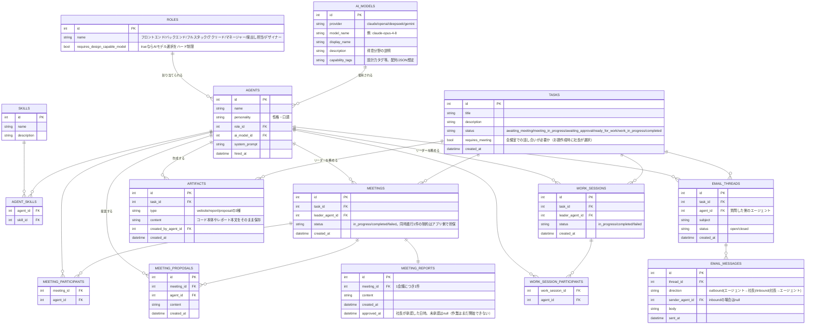

# DATABASE.md

本ファイルは `agents-company` のDBスキーマ設計のリファレンスです。エージェントが複数体に増えることを見据えて設計しました。

**ステータス**: ER図・テーブル構成は2026-07-25時点でレビュー済み（確定）。**2026-07-27に、SQLAlchemyモデル・Alembicマイグレーション・初期データ投入（seed）・`agents_registry.py`のDB化・雇用/お題/会議のDB永続化・お題の状態遷移（会議要否・レポート承認ゲート）・1お題1成果物の協力作業フローまで実装済み**（下記「今後の実装ステップ」の1〜7）。**2026-07-29に、会議・作業の並行処理化（予約→バックグラウンド実行）・完了/失敗のメール通知・エージェントの稼働状況（busy）管理を追加実装**（`work_sessions`/`work_session_participants`テーブル新設、`tasks.status`に`meeting_in_progress`/`work_in_progress`追加。既存の`email_threads`/`email_messages`を通知用途で実装に使い始めた）。エージェント雇用（`agents`/`agent_skills`）、お題の作成・編集・削除・状態遷移（`tasks`）、会議室（`meetings`/`meeting_participants`/`meeting_proposals`/`meeting_reports`）、作業（`work_sessions`/`work_session_participants`）、成果物（`artifacts`、1お題1件）、メール通知（`email_threads`/`email_messages`）は、いずれも`backend-core/scripts/game_cli.py`から実際にDBへ読み書きする形で動作確認済み（REST API化はまだ）。セットアップ手順・動かし方は`memo/DB利用方法.md`・`memo/game_cli使い方.md`を参照。残り（REST API化・メール返信機能）は未着手（進捗管理は`AGENTS.md`の「今後の実装予定（ロードマップ）」を参照）。

**実装にともなう変更点**: `agents.id`はint PKのため、`POST /api/tasks`・`GET /api/agents`で使う`agent_id`はDB化前の文字列（例: `"idea_agent"`）から**数値**に変わっている。

## 前提となる主な機能

DB設計は、以下の機能を実現することを前提にしています。

- **エージェントを雇う機能**: 各エージェントは性格・名前・キャラクター・役割（役職）・スキルを持つ。
- **複数エージェントでの対話機能**: お題の内容によって進行フローが変わる（誰が呼ばれるか・何ステップ踏むか等）。これは主にLangGraph側（条件付きEdge）の設計課題であり、DB側は「どのフローを通って進んだか」の結果を記録できれば十分という整理。
- **エージェントの立場（役職）指定**: フロントエンド／バックエンド／フルスタック／テクリード／マネージャー／案出し担当／デザイナー。社長が自由に指定できるが、**テクリード等「上流工程」寄りの役職では、選べるAIモデルをハード制限する**（設計・判断に強いモデルしか選択肢に出さない）。
- **エージェント作成時のAIモデル指定**: 例）claude-opus、claude-haiku等。各モデルの得意分野は**事前にDBへ登録**しておき、選択時に表示する。
- **お題だし機能（社長）**: お題を登録する時点で、**会議室での話し合いが必要かどうか**を社長が選択する（`tasks.requires_meeting`）。
- **会議室での話し合い機能**: 社長が「リーダー」と「参加者」を指定 → 各参加者が提案を出す → リーダーが全提案を集約して会議レポートを作成する。**会議室は1つのみ**（拠点構成の通り）。同時に進行できる会議は常に1件という制約は、DBではなく**アプリケーション側のロジックで担保**する（DB制約は設けない）。
- **レポート承認ゲート**: 会議が必要なお題は、会議でレポートができた後も**社長がレポートを承認するまで作業は始まらない**（`meeting_reports.approved_at`）。
- **作業機能（単一成果物への協力）**: 1つのお題につき成果物は**1件だけ**。複数のエージェント（worker）がタスクの役割分担を決めて協力し、**リーダー**が最終的な成果物として統合する（会議と同様、作業にもリーダーを置く）。
- **会議・作業の並行処理**: 会議・作業はLLM呼び出しに時間がかかるため、「予約（DBに進行中の状態を記録）→バックグラウンド実行」の2段階に分け、社長は完了を待たずに他の操作を続けられる（`tasks.status`の`meeting_in_progress`/`work_in_progress`、`work_sessions`テーブル）。完了・失敗は`email_threads`/`email_messages`を使ったメール通知で知らせる。
- **エージェントの稼働状況（busy）管理**: 進行中の会議・作業に参加しているエージェントは、他のお題の会議・作業には二重に割り当てられない（`meetings`/`work_sessions`の`status == "in_progress"`から判定。DBに専用カラムは設けない）。
- **エージェントの作業内容をリアルタイムで閲覧できる機能**（配信方式・イベント設計は`AGENTS.md`の「ストリーミング配信」節を参照）。
- **作業結果を見る機能**: まずはWebサイト・レポート・企画案の3種類に絞る。Webサイトは、生成したコードをDBに保存し、ゲーム内で簡易プレビュー表示するところから始める（実際のホスティング環境へのデプロイは将来検討）。
- **メール送信機能**: エージェントが確認・質問事項をメールで送信し、社長がメール返信で応答する。実際のメール送受信システム連携（送信はSMTP等、受信はSendGridのInbound Parse等）を見越した、本格的なメールスレッド構成（スレッド単位＋メッセージ単位）で設計する。

## 全体ER図

## テーブル定義と説明

### `ai_models` — 使用可能なAIモデルのマスタ

エージェントに割り当てられるAIモデルを事前登録しておくテーブル。`capability_tags`に「design」「coding」等のタグを持たせ、`roles.requires_design_capable_model`と突き合わせて、役職ごとに選択可能なモデルを絞り込む（ハード制限）ために使う。

| フィールド | 型 | 説明 |
|---|---|---|
| id | int (PK) | |
| provider | string | claude / openai / deepseek / gemini |
| model_name | string | 例: `claude-opus-4-8` |
| display_name | string | UI表示名 |
| description | string | 得意分野の説明文（エージェント作成画面に表示） |
| capability_tags | string[] | 得意分野タグ（配列 or JSON想定） |

### `roles` — エージェントの役職マスタ

フロントエンド／バックエンド／フルスタック／テクリード／マネージャー／案出し担当／デザイナーなどを管理する。`requires_design_capable_model`が`true`の役職は、`ai_models`側で該当する`capability_tags`を持つモデルしか選択肢に出さない。

| フィールド | 型 | 説明 |
|---|---|---|
| id | int (PK) | |
| name | string | 役職名 |
| requires_design_capable_model | bool | trueならAIモデル選択をハード制限 |

### `skills` — スキルマスタ

雇用時にエージェントへ複数付与するスキルの定義。

| フィールド | 型 | 説明 |
|---|---|---|
| id | int (PK) | |
| name | string | スキル名 |
| description | string | 説明 |

### `agents` — 雇用したスタッフ本体

現状は`backend-core/app/services/agents_registry.py`の静的な辞書で管理しているエージェント一覧を、DB化した先の姿。`system_prompt`は`agents/*.md`で管理していたペルソナ定義の実体をここに持たせる想定（詳細は移行時に決定）。

| フィールド | 型 | 説明 |
|---|---|---|
| id | int (PK) | |
| name | string | エージェント名 |
| personality | string | 性格・口調 |
| role_id | int (FK → roles) | |
| ai_model_id | int (FK → ai_models) | |
| system_prompt | string | LLMに渡すsystemメッセージ本文 |
| hired_at | datetime | 雇用日時 |

### `agent_skills` — エージェントとスキルの多対多中間テーブル

| フィールド | 型 | 説明 |
|---|---|---|
| agent_id | int (FK → agents) | |
| skill_id | int (FK → skills) | |

### `tasks` — 社長が出したお題

`status`は固定の状態遷移で管理する: `requires_meeting=true`なら`awaiting_meeting`（会議未実施）→`meeting_in_progress`（会議がバックグラウンドで進行中）→`awaiting_approval`（レポートができたが未承認）→`ready_for_work`（作業割り当て可能）→`work_in_progress`（作業がバックグラウンドで進行中）→`completed`（成果物完成）。`requires_meeting=false`なら`awaiting_meeting`/`meeting_in_progress`/`awaiting_approval`を経由せず、作成直後から`ready_for_work`になる。`meeting_in_progress`/`work_in_progress`の間はお題の編集・削除ができない。

| フィールド | 型 | 説明 |
|---|---|---|
| id | int (PK) | |
| title | string | お題タイトル |
| description | string | お題の詳細 |
| status | string | 進行状況（上記の状態遷移） |
| requires_meeting | bool | 会議室での話し合いが必要か（お題作成時に社長が選択） |
| created_at | datetime | |

### `meetings` — 会議室で行われた会議の記録

会議室は物理的に1つのみ（`AGENTS.md`の拠点構成の通り）。そのため「同時に進行中（`status == "in_progress"`）の会議は常に1件まで」という制約があるが、これは**DB制約ではなくアプリケーション側のロジックで担保する**方針（新規会議を開始する前に、進行中の会議が無いかをアプリ側でチェックする）。`leader_agent_id`は`meeting_participants`に含まれるエージェントの中から社長が指名する。会議は「予約（行の作成・`in_progress`）→バックグラウンドでLLM呼び出し（`completed`または`failed`）」の2段階で進む（`app/services/meetings.py`の`start_meeting`/`finish_meeting`）。この行が`in_progress`の間、参加エージェントは他のお題の会議・作業には割り当てられない（`app/services/availability.py`）。

| フィールド | 型 | 説明 |
|---|---|---|
| id | int (PK) | |
| task_id | int (FK → tasks) | |
| leader_agent_id | int (FK → agents) | 社長が指名したリーダー |
| status | string | `in_progress` / `completed` / `failed`（同時1件の制約はアプリ側で担保） |
| created_at | datetime | |

### `meeting_participants` — 会議への参加者（多対多）

| フィールド | 型 | 説明 |
|---|---|---|
| meeting_id | int (FK → meetings) | |
| agent_id | int (FK → agents) | |

### `meeting_proposals` — 各参加者が会議で出した提案

1つの会議に対して、参加者の人数分〜複数件の提案が紐づく。

| フィールド | 型 | 説明 |
|---|---|---|
| id | int (PK) | |
| meeting_id | int (FK → meetings) | |
| agent_id | int (FK → agents) | 提案したエージェント |
| content | string | 提案内容 |
| created_at | datetime | |

### `meeting_reports` — リーダーが集約した会議レポート

リーダーが全ての`meeting_proposals`を集約して作成するレポート。1会議につき1件（`meeting_id`にユニーク制約を張る）。社長が`approved_at`をセット（承認）するまで、対応する`tasks.status`は`awaiting_approval`のままで、作業は割り当てられない。

| フィールド | 型 | 説明 |
|---|---|---|
| id | int (PK) | |
| meeting_id | int (FK → meetings, unique) | 1会議につき1件 |
| content | string | レポート本文 |
| created_at | datetime | |
| approved_at | datetime, nullable | 社長が承認した日時。未承認はnull |

### `work_sessions` — 作業室での作業割り当ての記録

`meetings`/`meeting_participants`と同じ構成。作業は「予約（行の作成・`in_progress`、`Task.status`を`work_in_progress`に）→バックグラウンドでLLM呼び出し（`completed`または`failed`）」の2段階で進む（`app/services/work.py`の`start_work`/`finish_work`）。この行が`in_progress`の間、担当者（worker・リーダー）は他のお題の会議・作業には割り当てられない（`app/services/availability.py`）。会議と異なり、同時に進行できる作業の件数に制限はない（担当エージェントが重複しなければ複数件並行できる）。

| フィールド | 型 | 説明 |
|---|---|---|
| id | int (PK) | |
| task_id | int (FK → tasks) | |
| leader_agent_id | int (FK → agents) | 社長が指名したリーダー |
| status | string | `in_progress` / `completed` / `failed` |
| created_at | datetime | |

### `work_session_participants` — 作業の担当者（多対多。リーダーも含む）

| フィールド | 型 | 説明 |
|---|---|---|
| work_session_id | int (FK → work_sessions) | |
| agent_id | int (FK → agents) | |

### `artifacts` — 作業結果（成果物）

最初はWebサイト・レポート・企画案の3種類に絞る。Webサイト種別は、生成したコードを`content`にそのまま保存し、フロント側でiframe等による簡易プレビュー表示を行う第一段階とする（実ホスティングは将来検討）。**1つのお題(`task_id`)につき、成果物は1件だけ**（複数の担当者が役割分担して協力し、リーダーが1つに統合した最終成果物を`created_by_agent_id`＝リーダーとして保存する）。

| フィールド | 型 | 説明 |
|---|---|---|
| id | int (PK) | |
| task_id | int (FK → tasks) | |
| type | string | `website` / `report` / `proposal` |
| content | string | コード本体やレポート本文をそのまま保存 |
| created_by_agent_id | int (FK → agents) | 作成したエージェント |
| created_at | datetime | |

### `email_threads` — 確認・質問のやり取り単位

1つのタスク・1体のエージェントに対して複数のスレッドが立ちうる。**2026-07-29時点の実装では、会議・作業の完了/失敗を社長に一方向で知らせる通知として使っている**（`app/services/notifications.py`。`status`は`open`=未読、`closed`=既読の意味で使用）。エージェントからの確認・質問や、社長からの返信（`inbound`）はまだ実装していない。

| フィールド | 型 | 説明 |
|---|---|---|
| id | int (PK) | |
| task_id | int (FK → tasks) | |
| agent_id | int (FK → agents) | 質問した側のエージェント |
| subject | string | 件名 |
| status | string | `open` / `closed` |
| created_at | datetime | |

### `email_messages` — スレッド内の個別メッセージ

`direction`が`outbound`はエージェント→社長への送信、`inbound`は社長がメール返信した内容の取り込みを表す。

| フィールド | 型 | 説明 |
|---|---|---|
| id | int (PK) | |
| thread_id | int (FK → email_threads) | |
| direction | string | `outbound` / `inbound` |
| sender_agent_id | int (FK → agents, nullable) | `inbound`の場合はnull |
| body | string | 本文 |
| sent_at | datetime | |

## 決定事項メモ

- AIモデルの得意分野情報: `ai_models`テーブルで管理（コード内静的定義ではなくDB化）。
- 上流工程寄りの役職でのAIモデル選択: ハード制限（`roles.requires_design_capable_model`と`ai_models.capability_tags`の突き合わせで選択肢を絞る）。
- Webサイト成果物の表示: 第一段階は「コード保存＋簡易プレビュー」（`artifacts.content`に直接保存し、フロントでiframe等表示）。実ホスティングは将来検討。
- メール機能: 本格的なメールスレッド設計（`email_threads`/`email_messages`）をこの段階から用意する。
- 会議室の同時進行制限: DB制約ではなくアプリケーションロジックで担保（`meetings`テーブル自体はお題ごとに1行のまま）。
- お題の状態遷移: `awaiting_meeting`→`meeting_in_progress`→`awaiting_approval`→`ready_for_work`→`work_in_progress`→`completed`の6値で`tasks.status`を管理（2026-07-27決定、`meeting_in_progress`/`work_in_progress`は2026-07-29追加）。会議不要なら最初から`ready_for_work`。
- 成果物は1お題につき1件: 複数の担当者（worker）が役割分担して協力し、リーダーが最終成果物として統合する（`artifacts`は1件だけ作成。各workerの個別の担当パートはDBに保存しない）。
- 会議・作業の並行処理（2026-07-29決定）: LLM呼び出しに時間がかかるため、「予約（DBに`in_progress`の行を作成しコミット）→バックグラウンドタスクでLLM呼び出し」の2段階に分ける。予約フェーズを即座にコミットすることで、他のセッションからも「誰が今busyか」がすぐに見える。
- エージェントのbusy判定にDBカラムは追加しない: `meetings`/`work_sessions`の`status == "in_progress"`から動的に判定する（`app/services/availability.py`）。
- メール通知は既存の`email_threads`/`email_messages`を流用: 新しいテーブルを増やさず、`direction="outbound"`のメッセージとして会議・作業の完了/失敗を記録する。

## 今後の実装ステップ

1. [x] `backend-core/app/models/`にSQLAlchemyモデルを実装する。（2026-07-27完了）
2. [x] Alembicで初期マイグレーションを作成する。（2026-07-27完了。`alembic/versions/91ff22838ff5_初期スキーマ作成.py`）
3. [x] `ai_models`・`roles`・`skills`の初期データ投入（seedスクリプト）を用意する。（2026-07-27完了。`backend-core/scripts/seed_db.py`）
4. [x] `app/services/agents_registry.py`の静的な辞書を、DB参照（`agents`テーブル）に切り替える。（2026-07-27完了。`agent_id`がint化）
5. [x] 会議室のDB永続化（`meetings`/`meeting_participants`/`meeting_proposals`/`meeting_reports`の作成、「進行中の会議は1件まで」のアプリ側チェック）を実装する。（2026-07-27完了。`backend-core/app/services/meetings.py`+`meeting_graph.py`。REST APIとしてはまだ公開していない）
6. [x] 成果物の永続化（`artifacts`）を実装する。（2026-07-27完了。`backend-core/app/services/work.py`。REST APIとしてはまだ公開していない）
7. [x] お題の状態遷移（会議要否・レポート承認ゲート）と、1お題1成果物の協力作業フローを実装する。（2026-07-27完了。`tasks.requires_meeting`/`meeting_reports.approved_at`カラム追加、`backend-core/app/services/work_graph.py`新規、`work.py`/`meetings.py`更新）
8. [x] お題の編集・削除（`work.update_task`/`work.delete_task`）を実装する。（2026-07-29完了）
9. [x] 会議・作業の並行処理化（予約→バックグラウンド実行）、メール通知、エージェントのbusy判定を実装する。（2026-07-29完了。`work_sessions`/`work_session_participants`テーブル新規、`tasks.status`に`meeting_in_progress`/`work_in_progress`追加、`app/services/availability.py`・`app/services/notifications.py`新規）
10. [ ] 上記5・6・7・9のREST API化（`app/api/`配下。フロントエンド結合用）
11. [ ] メールへの返信機能（`inbound`）・外部メール送受信システム連携（送信・受信）を設計・実装する。

進捗の管理は`AGENTS.md`の「今後の実装予定（ロードマップ）」で行う。セットアップ手順・動かし方は`memo/DB利用方法.md`を参照。

## 関連ドキュメント

- `AGENTS.md`: プロジェクト全体のガイド・アーキテクチャ方針・開発ワークフロー。
- `memo/DB利用方法.md`: マイグレーション・seedの実行手順、動作確認方法、トラブルシューティング。
- `memo/変更履歴.md`: 実装が完了した際の記録先。
